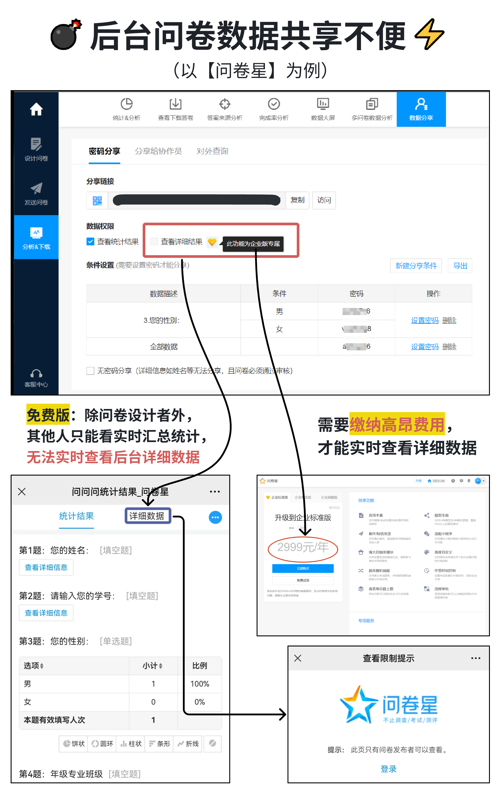

# 社团招新干货1: 省50%工作量的报名表设计! 

很多社团在设计报名问卷时，对后续的使用步骤没考虑周全。
这会导致信息同步不及时、格式不规范、问卷之间数据不互通等问题，导致工作量暴增！
🤔今天我们着重讲第一个问题：「信息同步不及时」

## 👉「对入社的同学而言」
他们填写问卷后，可能发现之前填错了，甚至怕自己没填过想重新填
而一些平台不支持用户事后查询/修改(或者相关功能很贵，如问卷星……)
所以往往会有同学重复填写✍

## 👉「对社团管理层而言」
有的社团用问卷星(免费版)设计，详细数据只有问卷设计者能实时查看
每当有部长要求查看详细数据，都需要设计者手动导出Excel发内部群

甚至有社团内部要求设计者：每导出一次都要做好分组和汇总
(比如统计当前所有报名人数、按各部门分组汇总、按面试场次分组汇总……)
而且还要过滤掉部分同学重复填写的信息。

🤯于是工作量倍增！而且后台整理还容易错漏！给社团内部积累怨气
有社团就是整理过程中，漏掉一些报名干事的电话号码，导致社团白白损失潜在的人才！
此外，校对过程还容易泄漏大家填写的信息！！

## 换用其他工具的必要性
🤨有人可能会问：别的社团和组织一直都在用这些工具，不都好好的嘛？
因为他们偏向工作性质，有一定强制性，但也有显眼的利益(比如高额的综测加分等)
所以他们大都能为了效率，干重复枯燥的事，即便对此有埋怨
而且很多新生抢着加入呢，报名麻烦点都无所谓

⛱可大部分社团都偏向娱乐性质，没啥强制性
大家对社团的兴趣，很容易在重复枯燥的工作中消磨掉
所以应当从源头减少不必要的工作量！

## 🔍那还有什么工具能解决问题呢？
我个人推荐用多维表格类型的工具，比如腾讯收集表、维格表、伙伴云、轻流、AirTable等
总之选择问卷工具时，应至少参照以下3项功能👇
- 后台数据可分享给别人「实时查看」，且可限定仅部分人查看；
- 用户填写问卷后，可查看和修改填写结果；
- 后台可设置「每个账号仅限提交一条记录」，防止重复填写。

✅当然问卷星有自己的特色功能，比如限时考试、跳题逻辑等。
所以大家要根据自己的需求，选择适合的工具。
比如一些社团的数据收集业务相对简单，而且社团成员都是电脑小白，建议先用「腾讯收集表」，上手方便。
而我之前的社团业务更精细，用「维格表」方便自动跨表同步。但初始配置较复杂，对小白有门槛。
欢迎大家在评论区发表更多见解~

## ⏩「预告」
后续的帖子，我会对后台数据格式错乱、跨表同步等问题，提出解决方案~