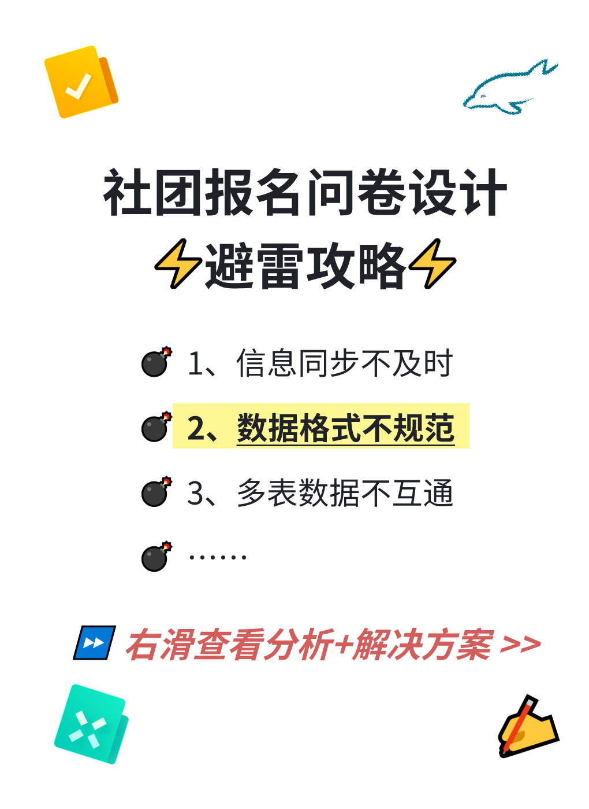
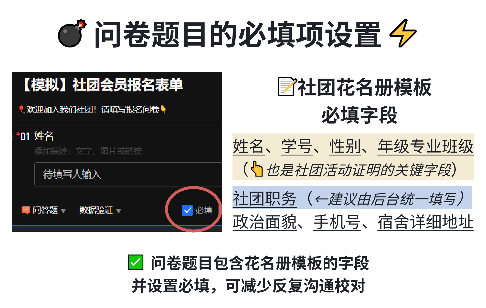
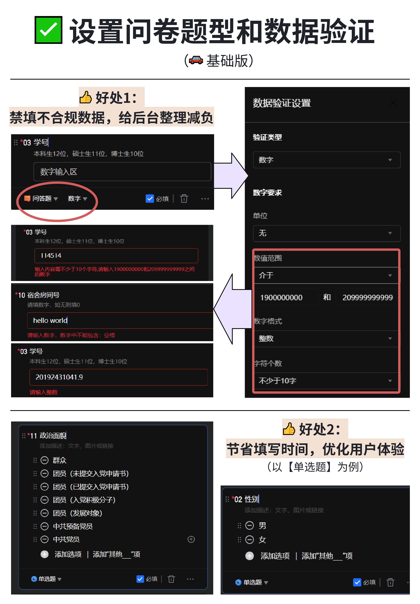
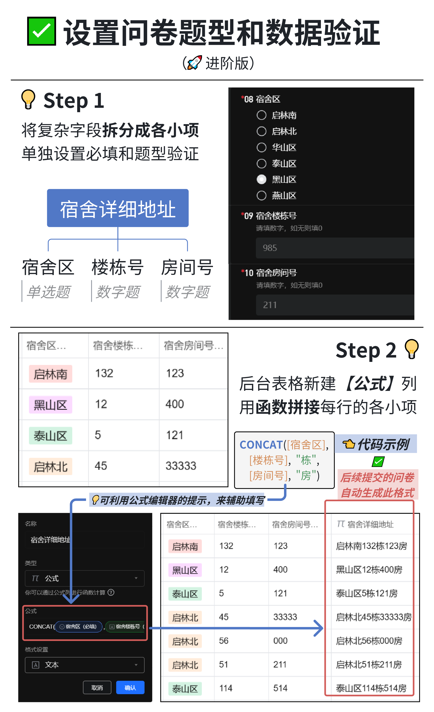
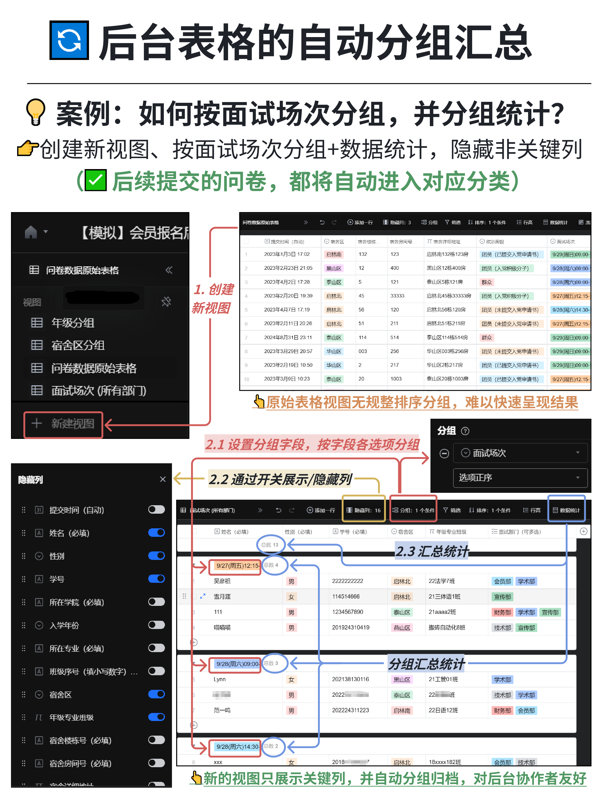
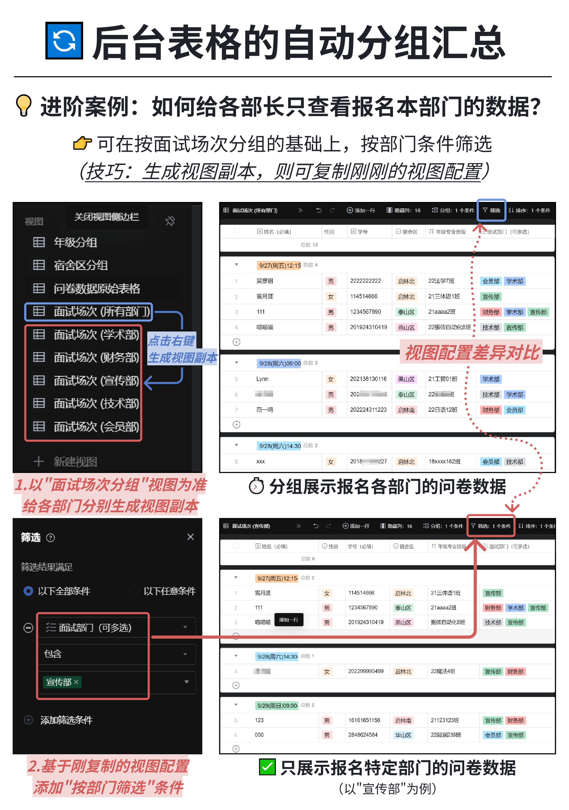

# 社团招新干货2: 怎样自动整理数据格式?

*[👉点击可进入小红书浏览](https://www.xiaohongshu.com/explore/66d81dee000000000c019509)*

在上篇帖子，我们换用新工具，解决了两个问题：
问卷数据同步不及时、问卷收集重复
⏩这篇聊聊如何「自动整理好数据格式」，再砍掉一半工作量！

## 一、设置必填项
有些社团收集的数据，不是这个人漏了学号，就是那个人没填班级
而报名数据要按格式上交社联，有些招人困难的社团只好逐一私聊校对
😫这就是「未设置必填项」惹的祸！
其实解决方法很简单：给报名表单的一些关键题目设置必填就好~
只要有一道必填题目缺漏，都无法提交问卷🚫

## 二、限定题目的数据类型
👍给问卷题目设置「数据验证」，有两大好处：
- 让乱填的数据无法提交，给后台整理减负(比如“手机号”/“学号”设为数字题型)
- 节省填写时间，优化用户体验(比如“性别”“政治面貌”设置为单选题型)

🧐而有些题目(如“年级专业班级”)格式要求复杂
又有数字又有汉字，还能设置数据验证嘛？
可如果没有任何校验，后台容易收到格式混乱的数据⚠
这又该怎么办呢？

💡「把它们拆成各小项，单独设置题型；后台用公式拼接各小项」
即便是新填写的数据，也会自动生成你想要的格式🔄
要调整的内容瞬间减少90%✅

## 三、自动分组汇总
上篇帖子里，问卷星每次导出问卷数据，都要分组汇总整理，太麻烦了啊啊啊！
但在多维表格工具里，这些都可以提前配置好，后台帮我们自动分组汇总🔄
📚这就是「视图」的妙用——

不同视图配置不同的记录分组+筛选、字段展示，随时提供不同查看视角！

🧩再搭配刚刚的「复杂字段 拆分+拼接」，又能提供更丰富的视角啦~
(图片里有丰富的案例介绍可参考📝)

## ⏩预告
后续我会用多篇帖子介绍「跨表同步」，适用于更自动化的招新业务，以及社团日常的活动管理
同时也会穿插前面提到的内容，并使用其他工具作比较↩